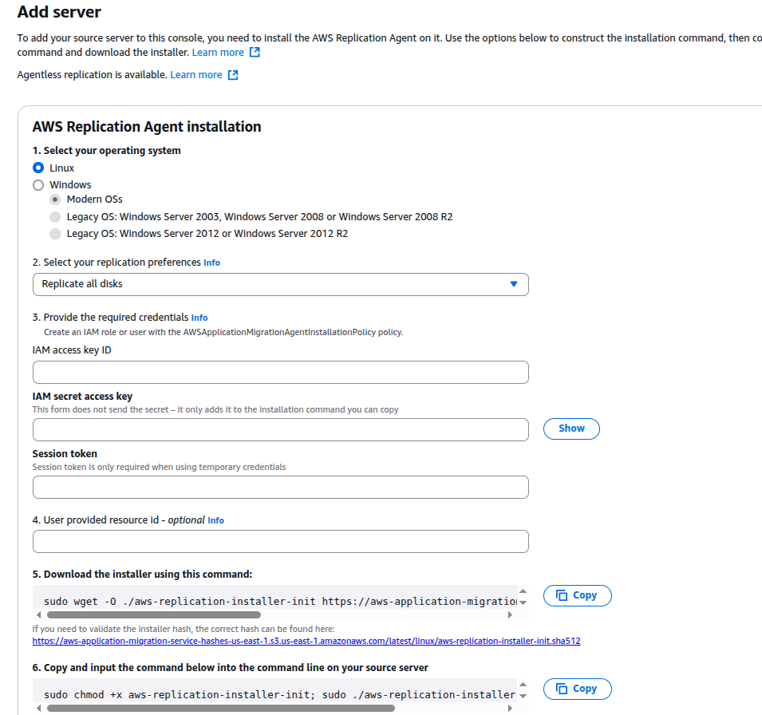

# AWS Application Migration Guide

This repository provides a comprehensive guide to migrating on-premises virtual machines (VMs) to Amazon EC2 using the AWS Application Migration Service.

## Prerequisites

- An active AWS account in a supported region.
- Network connectivity between your on-premises environment and AWS, either through AWS Direct Connect, VPN, or the internet.
- Administrative access to the source VMs intended for migration.

## Workflow Diagram


## Architectural Diagram


## Migration Steps

1. **Initialize AWS Application Migration Service:**
   - Access the [AWS Application Migration Service Console](https://console.aws.amazon.com/mgn).
   - Set up the service for your AWS account.





2. **Configure the Staging Area:**
   - In your AWS Management Console, set up a staging area subnet within your VPC.
   - Ensure the subnet has the necessary permissions and resources for data replication.

3. **Install the AWS Replication Agent on Source Servers:**
   - Download the AWS Replication Agent from the [official AWS documentation](https://docs.aws.amazon.com/mgn/latest/ug/install-agent.html).
   - Install the agent on each on-premises VM you plan to migrate.

```shell
Sample-Commands:
sudo wget -O ./aws-replication-installer-init https://aws-application-migration-service-us-east-1.s3.us-east-1.amazonaws.com/latest/linux/aws-replication-installer-init

sudo chmod +x aws-replication-installer-init; sudo ./aws-replication-installer-init --region us-east-1
```


4. **Monitor Data Replication:**
   - Use the Application Migration Service console to monitor replication progress.
   - Wait for the initial synchronization to complete before proceeding.


5. **Launch Test Instances:**
   - After replication, launch test instances in AWS to verify successful migration.
   - Conduct user acceptance testing (UAT) to ensure applications are functioning correctly.


6. **Finalize the Cutover:**
   - Once testing is successful, perform the cutover to the AWS environment.
   - Decommission the original on-premises VMs if they are no longer needed.


## Best Practices

- Avoid taking source servers offline or rebooting them until the cutover is complete.
- Allocate sufficient time for user acceptance testing to identify and resolve any issues.
- Regularly monitor the replication status to detect and address potential problems early.
- Use temporary AWS Identity and Access Management (IAM) credentials for agent installation to enhance security.

## Additional Resources

For more detailed information, refer to the [AWS Prescriptive Guidance on migrating an on-premises VM to Amazon EC2 using AWS Application Migration Service](https://docs.aws.amazon.com/prescriptive-guidance/latest/patterns/migrate-an-on-premises-vm-to-amazon-ec2-by-using-aws-application-migration-service.html).

